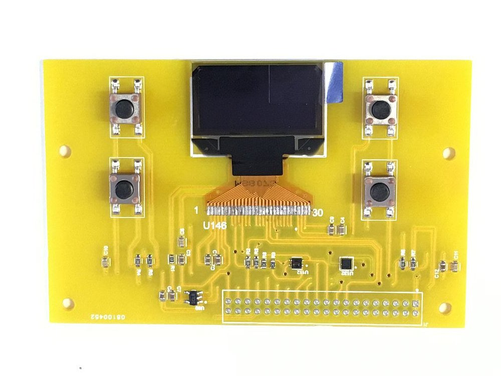

********
Overview
********

The micromez board has been created with the intention of providing a
platform for experimentation in interacting with a number of inputs and
outputs. These are all accessed from the Low Speed connector through GPIO
or I2C.

Items that are available are:

Inputs:
=======
    * Accelerometer
    * Temperature and Humidty sensor
    * Buttons

Outputs:
========
    * 128 x 64 pixel OLED display
